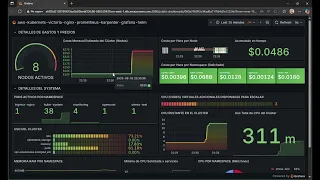

## 👋 Hi there! I'm Daniel

I'm an experienced web developer passionate about building cloud solutions, especially with AWS. I focus on creating functional and accessible digital experiences.

---

### 🚀 Featured Project: Production-Ready AWS EKS Kubernetes

**Production-Ready AWS EKS Kubernetes Cluster with Terraform, Autoscaling & Monitoring**

This project implements a complete Kubernetes infrastructure on AWS designed to be elastic, resilient, and fully automated using modern Infrastructure as Code (IaC) practices.

🌍 **Live Demos**
)

**🎯 Key Features**
* **Automated Infrastructure:** Terraform-managed EKS cluster with reproducible deployments
* **Intelligent Autoscaling:** Karpenter for node scaling + HPA for pod scaling
* **Comprehensive Monitoring:** VictoriaMetrics stack with Grafana visualization
* **Production Ready:** Highly available architecture with proper ingress management
* **Cost Optimization:** OpenCost integration for cost monitoring and optimization

**🏗️ Architecture Overview**
* **Cloud:** AWS EKS, EBS, VPC, IAM
* **Infrastructure:** Terraform, Helm, Karpenter
* **Monitoring:** VictoriaMetrics, Grafana, kube-state-metrics
* **Orchestration:** Kubernetes, Metrics Server, HPA
* **Networking:** Ingress-Nginx, AWS Load Balancer
* **Cost Management:** OpenCost

**🔗 Repository:** [View on GitHub](https://github.com/tecnopersona/Production-Ready-AWS-EKS-Kubernetes-Elastic-IaC-with-Terraform-Autoscaling-Monitoring)

---

### ☁️ AWS Resources and Exams

I've developed resources to help prepare for AWS certifications:

* **AWS Certified Cloud Practitioner Full Exam:** Comprehensive practice test
    🔗 [https://aws-examen.danielweb.cl/](https://aws-examen.danielweb.cl/)

* **Quick Exams (20 questions each):**
  * **Networking:** AWS networking concepts
    🔗 [https://tecnopersona.github.io/redes_aws/](https://tecnopersona.github.io/redes_aws/)
  * **Security:** AWS security best practices
    🔗 [https://tecnopersona.github.io/seguridad_aws/](https://tecnopersona.github.io/seguridad_aws/)
  * **Databases:** AWS database services
    🔗 [https://tecnopersona.github.io/bases_de_datos_aws/](https://tecnopersona.github.io/bases_de_datos_aws/)

### 🐍 Python Resources
* **Python Practice Exam:** Test your Python knowledge
🔗 [https://tecnopersona.github.io/desafios-python/](https://tecnopersona.github.io/desafios-python/)

---

### 🌐 Web Projects

* **Personal Portfolio:** [https://danielweb.cl/](https://danielweb.cl/)
* **Central Chile:** [https://centralchile.cl/](https://centralchile.cl/)
* **Turner Painting (Canada):** 
  * [https://turnerpainting.ca/](https://turnerpainting.ca/)
  * [https://turnerpaintingltd.ca/](https://turnerpaintingltd.ca/)
* **Angular Practice:** [https://angular.danielweb.cl/](https://angular.danielweb.cl/)

---

### 🛠️ Technical Skills

* **Languages:** JavaScript, Python, HTML/CSS, PHP, SQL
* **Frameworks:** React, Node.js, Flutter
* **Cloud & DevOps:** AWS, Terraform, Kubernetes, Docker, Git
* **Specialties:** Cloud Architecture, Infrastructure Automation, Scalable Systems

---

### 📫 Let's Connect

* **Email:** info@danielweb.cl | danieljimenezweb@gmail.com
* **LinkedIn:** [linkedin.com/in/danieljimenezpernia](https://www.linkedin.com/in/danieljimenezpernia/)
* **Twitter:** [x.com/tecnopersona](https://x.com/tecnopersona)
* **GitHub:** [github.com/tecnopersona](https://github.com/tecnopersona)

---
